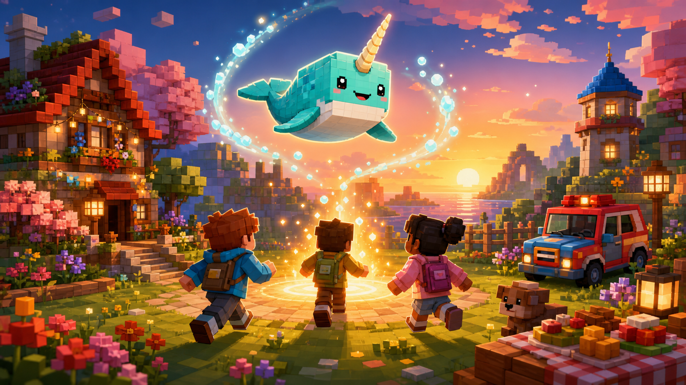
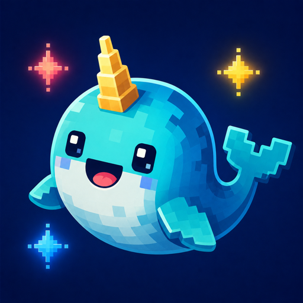

# NARwhal Together



**Little tools for big Minecraft adventures together.**

NARwhal Together is a family-focused Fabric mod that makes local and online multiplayer easier for young players. The name comes from Noelle, Aoife, and Rufus—the three original adventurers—and the project is designed around helping kids stay together and spend less time fighting menus.



## Teleport to Next Player

Press `G` to teleport to another online player.

- With one other player online, the action teleports directly to them.
- With several players online, repeated presses cycle through them alphabetically.
- A two-second cooldown prevents accidental repeated teleports.
- Players do not need operator permissions.

Controller players can bind **Teleport to Next Player** in their controller settings. [Controlify](https://modrinth.com/mod/controlify) can also place the action on its radial menu.

## Requirements

- Minecraft Java Edition 1.21.11
- Fabric Loader 0.19.3 or newer
- Fabric API
- Java 21 or newer
- The mod installed on every participating client and on the server or LAN host

Controlify is optional but recommended for controller play.

## Installation

1. Install Fabric Loader and Fabric API in the Minecraft 1.21.11 profile.
2. Copy the NARwhal Together JAR into the profile's `mods` directory.
3. Install the same JAR on the server or LAN host.
4. Start Minecraft and assign **Teleport to Next Player** to a controller button or radial-menu slot if desired.

## Build

```shell
./gradlew build
```

The distributable JAR is written to `build/libs/`.

## Testing and releases

- Follow [the multiplayer test checklist](docs/TESTING.md) before publishing.
- See [the release guide](docs/RELEASING.md) for GitHub and Modrinth setup.
- The Modrinth-ready project description is in [docs/MODRINTH.md](docs/MODRINTH.md).

## License

NARwhal Together is available under the [MIT License](LICENSE).
